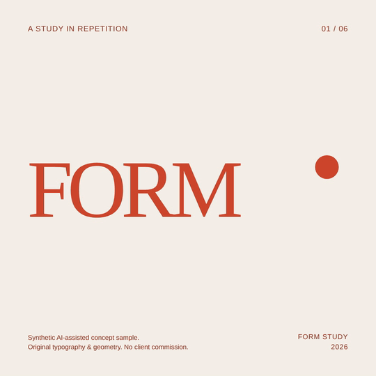
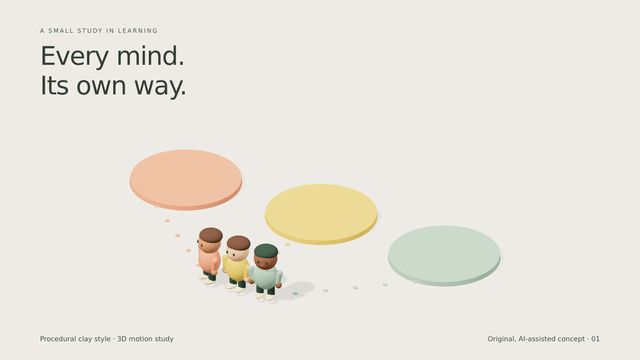

# Motion studies

Original, AI-assisted concept samples by Arda Ertürk. These are self-initiated studies, not commissioned client work.

## Form / After / Form

A six-second silent loop using original typography and geometry on warm ivory. No client artwork or brand logo is used.

[Download the 1080 × 1080 MP4](samples/form-after-form/form-after-form.mp4?raw=true)

- MP4: 1080 × 1080, 30 fps, 6 seconds, silent.
- GIF preview: 540 × 540, 6 seconds, looping.
- AI assistance: composition development and rendering; visual and technical checks completed.

## Every mind. Its own way.

An eight-second procedural clay-style study: three consistent 3D characters follow separate paths to reading, counting and building stations.

[Download the 1600 × 900 MP4](samples/clay-learning-study/clay-learning-study.mp4?raw=true)

- MP4: 1600 × 900, 24 fps, 8 seconds, silent.
- GIF preview: 640 × 360, 12 fps, 8 seconds, looping.
- Method: code-authored Three.js geometry and materials, with animation evaluated at a deliberate 12 fps cadence and rendered through HyperFrames. AI assisted the code and composition.
- Scope shown: simple figures, learning objects, lighting, shadows and consistent procedural motion. No client material, stock character assets, commissioned classroom film or teaching-effectiveness claim is involved.
- This study does not demonstrate voice production, complex character acting or delivery of a full video series. Visual frames and the decoded video were checked.
